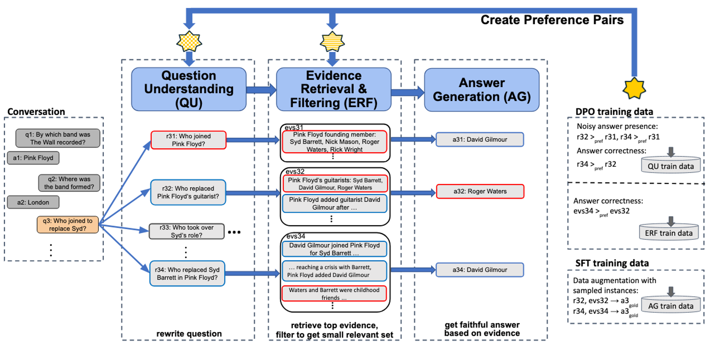

PRAISE: Preference-based Learning with Retrieval Augmented Generation for Conversational Question Answering
============

Description
------------

This repository contains the code and data for our WWW'25 short paper. Our method PRAISE (Preference-based
      Learning with Retrieval Augmented Iterative SEquence generation for ConvQA), is a pipeline architecture, consisting of <i>question understanding (QU)</i>, <i>evidence retrieval and filtering (ERF)</i> and <i>answer generation (AG)</i>.  We train  LLMs for each of the three subtasks. Since labeled training data for individual subtasks is unavailable in practice, PRAISE learns from its own generations using the final answering performance as feedback. More precisely, PRAISE samples generations from an initial model and learns from pairing successful and unsuccessful generations using <i>Direct Preference Optimization (DPO)</i>.
     

<center></center>

*Overview and illustration of PRAISE (preferred/correct outputs are in blue, incorrect/uninformative outputs in red).*

For more details see our paper: [Preference-based Learning with Retrieval Augmented Generation for Conversational Question Answering](https://arxiv.org/pdf/2503.22303). 
<!--and visit our project website: https://praise.mpi-inf.mpg.de.-->

If you use this code, please cite:
```bibtex
@article{kaiser2025preference,
  title={Preference-based Learning with Retrieval Augmented Generation for Conversational Question Answering},
  author={Kaiser, Magdalena and and Weikum, Gerhard},
  booktitle={WWW},
  year={2025}
 }
```

Setup 
------

We conduct experiments on [ConvMix](https://convinse.mpi-inf.mpg.de/), a ConvQA benchmark over heterogeneous sources.

All code was tested on Linux with Python 3.12.
<!--The relevant software and libraries include the following:

* Python 3.12

* Spacy 3.2.3

* Tagme 0.1.3

* Numpy 1.22.4

* Tensorflow 2.6.0

* Tensorflow Probability 0.14.1

* Pytorch 1.12.0

* Transformers 4.20.1

* TF-Agents 0.10.0

* Neo4j 4.3.7

* Scikit-learn 1.0.1-->

To install the required libraries, it is recommended to create a virtual environment:
```
   # using pip
   python3 -m venv PRAISE_ENV 
   source PRAISE_ENV/bin/activate
   pip install -r requirements.txt
  
   # using conda
   conda create --name PRAISE_ENV --file requirements.txt
   conda activate PRAISE_ENV
```

Data
------

To initialize the repo (download data, benchmark, models), run:

```
bash initialize.sh
```

### Dependencies

For the retrieval, we make use of EXPLAIGNN and CLOCQ: 

1. Create a separate virtual environment for EXPLAIGNN:

```
cd EXPLAIGNN/
conda env create --file conda-explaignn.yml
conda activate explaignn
pip install -e .
```

2. Integrate CLOCQ via the [publicly available API](https://clocq.mpi-inf.mpg.de), using the client from [the repo](https://github.com/PhilippChr/CLOCQ), it can be installed via:

```
bash make install_clocq
```

3. Initialize EXPLAIGNN, run (inside the EXPLAIGNN directory):

```
bash scripts/initialize.sh 
```


Run the PRAISE pipeline
------

Run the trained praise pipeline in inference mode: 

```
bash scripts/run_pipeline.sh --inference configs/pipeline_config.yml GPU GPU_NUM
```
with ``GPU`` indicating the respective GPU used for running PRAISE and ``GPU_NUM`` the type and number of gpus to use (e.g. A100:2)


Train individual components
------

For training, run: 

```
bash scripts/run_COMPONENT.sh  configs/COMPONENT_train_config.yml GPU GPU_NUM
```

where COMPONENT can be either ``qu`` (Question Understanding), ``erf`` (Evidence Retrieval and Filtering) or ``ag`` (Answer Generation).
